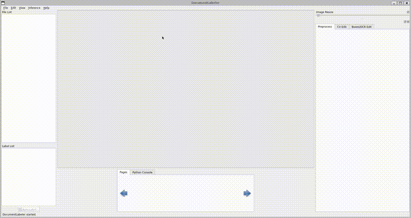
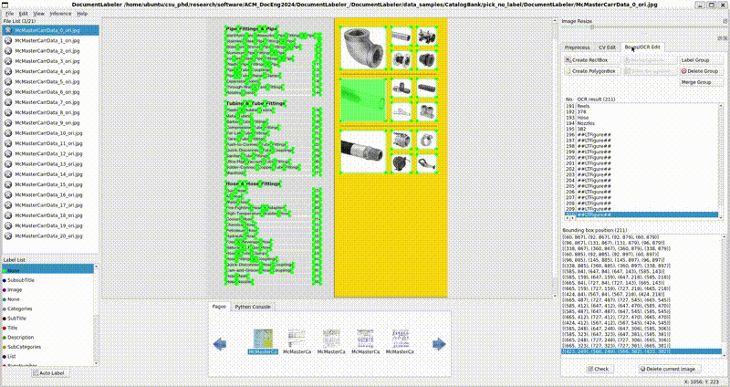
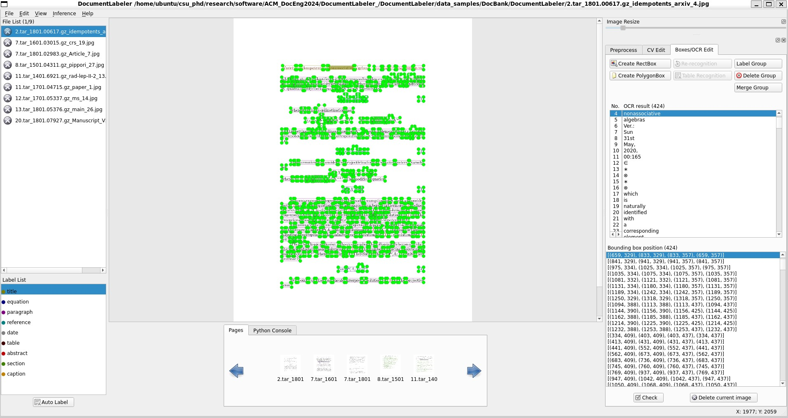
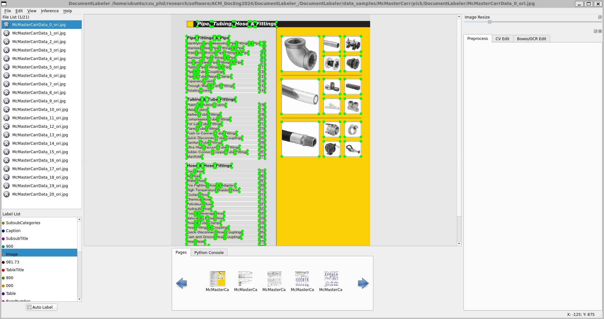
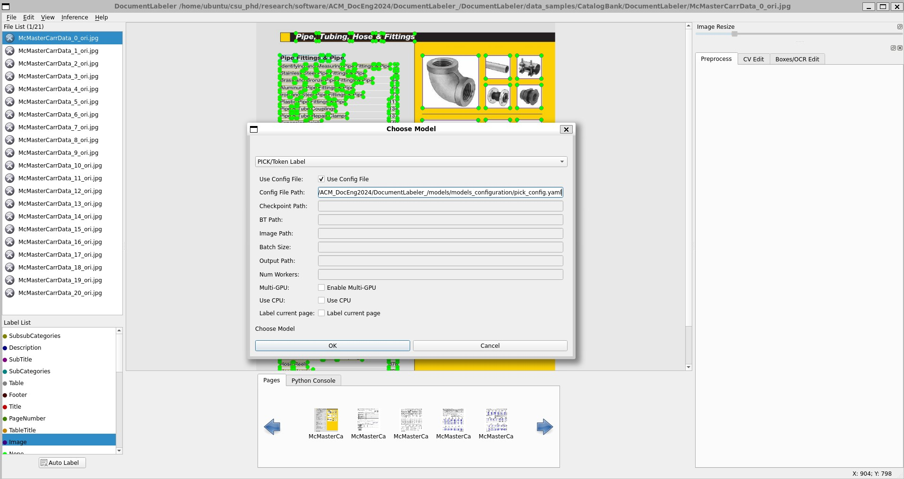
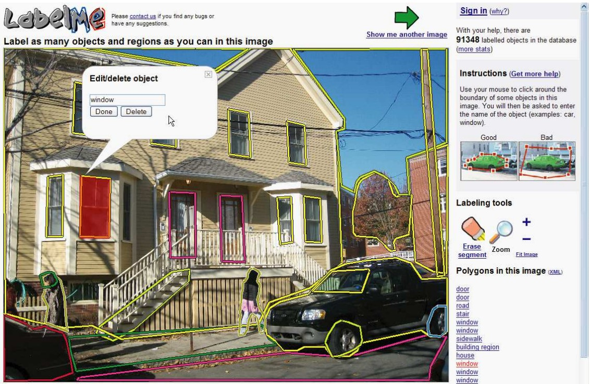
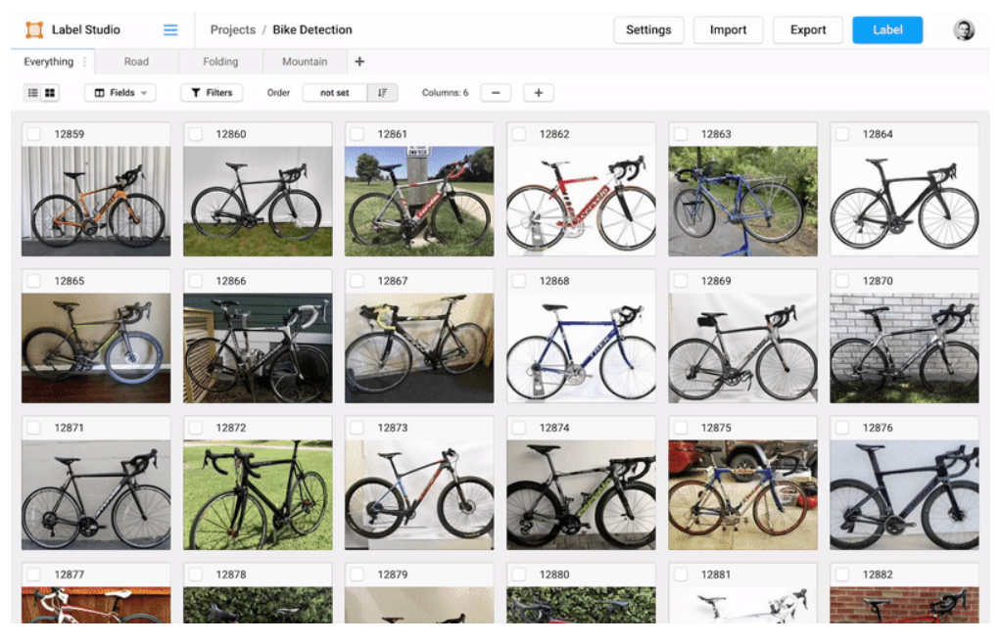
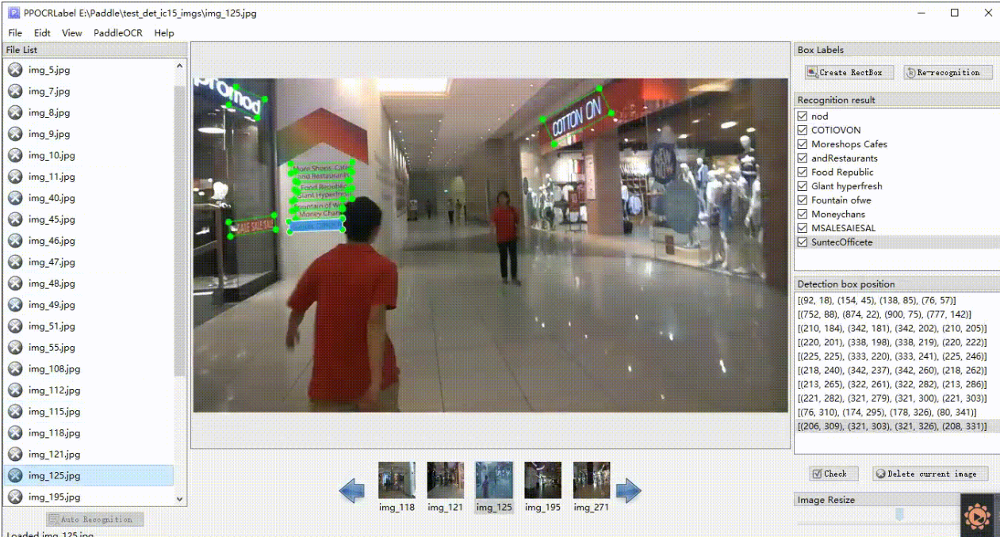

<div align="center" style="font-size: 22pt;"> 
  <h1 style="text-align: center;">DocumentLabeler 🏷️</h1>
  <a href="https://img.shields.io/badge/Made%20with-Python-1f425f.svg">
    
  </a>
  <a href="https://img.shields.io/github/stars/bankh/DocumentLabeler">
    
  </a>
  <a href="https://img.shields.io/github/forks/bankh/DocumentLabeler">
    
  </a>
  <a href="https://img.shields.io/github/contributors-anon/bankh/DocumentLabeler">
    
  </a>
  <a href="https://github.com/bankh/DocumentLabeler/blob/master/LICENSE">
    
  </a>

[Folder Structure](#folder-structure-of-the-repository)📂 | [Installation and Setup](#installation-and-setup-of-the-documentlabeler)⚙️ | [Usage of DocumentLabeler](#usage-of-documentlabeler)🏃| [Tools](#tools)🛠️ | [Cite](#cite)📜 | [Contact](#contact)📫 | [References](#references-and-other-software-tools)📖 
</div>

__Accompanying Semi-Automatic Annotation Tool to the Paper__  
[CatalogBank: A Structured and Interoperable Catalog Dataset with a Semi-Automatic Annotation Tool (DocumentLabeler) for Engineering System Design](https://doi.org/10.1145/3685650.3685665) as submitted in [ACM DocEng'24](https://www.documentengineering.org/doceng2024/program).  
**Abstract:** In the realm of document engineering and Natural Language Processing (NLP), the integration of digitally born catalogs into product design processes presents a novel avenue for enhancing information extraction and interoperability. This paper introduces CatalogBank, a dataset developed to bridge the gap between textual descriptions and other data modalities related to engineering design catalogs. We utilized existing information extraction methodologies to extract product information from PDF-based catalogs to use in downstream tasks to generate a baseline metric. Our approach not only supports the potential automation of design workflows but also overcomes the limitations of manual data entry and non-standard metadata structures that have historically impeded the seamless integration of textual and other data modalities. Through the use of DocumentLabeler, an open-source annotation tool adapted for our dataset, we demonstrated the potential of CatalogBank in supporting diverse document-based tasks such as layout analysis and knowledge extraction. Our findings suggest that CatalogBank can contribute to document engineering and NLP by providing a robust dataset for training models capable of understanding and processing complex document formats with relatively less effort using the semi-automated annotation tool DocumentLabeler.
<div align="center">
<table>
  <tr>
    <td align="center">
      <br>
      PICK<sup>[1]</sup> Import
    </td>
    <td align="center">
      <br>
      Deleting Multiple Boxes
    </td>
  </tr>
  <tr>
    <td align="center">
      <br>
      Labeling Multiple Boxes
    </td>
    <td align="center">
      <br>
      Merging Multiple Boxes
    </td>
  </tr>
</table>
<table>
  <tr>
  <td align="center">
      <br>
      PICK<sup>[1]</sup> Inference and Correction
    </td>
  </tr>
</table>
</div>

### __Folder Structure of the Repository__  <a name="folder-structure-of-the-repository"></a>
```
DocumentLabeler_
├── repo_assets/
│   └── (assets to build the readMe sources for this GitHub repository)
├── DocumentLabeler/
│   ├── data/
│   │   └── 
│   ├── data_samples/
│   │   └── (Sample data to test DocumentLabeler)
│   ├── libs/
│   └── resources/
├── models/
│   ├── models_configuration/
│   │   └── pick_config.yaml
│   └── pick/
│       ├── data
│       │   └── (data to train and test pick)
│       ├── data_utils
│       │   └── (data relevant classes for pick)
│       ├── examples
│       │   └── (Details of DocBank)
│       ├── logger
│       │   └── (class for data logging)
│       ├── model
│       │   └── (pick's architecture relevant classes)
│       ├── saved
│       │   └── (saved /log and /models-> trained model is not included)
│       ├── tests
│       │   └── (data to train and test pick)
│       ├── tools
│       │   └── (tools for train, data process)
│       ├── trainer
│       │   └── (model's training class)
│       ├── utils
│       │   └── (metric and other data utility classes)
│       └── (Model to experiment with DocumentLabeler and CatalogBank)
├── output/
│   └── (Inference results for batch process of the model)
└── tools/
    ├── training_scripts/
    │   └── (Bash scripts to train model)
    ├── data_utils/
    │   └── (Bash scripts to clean data)
    ├── DocumentLabeler_Notebooks/
    │   └── (IPython Notebooks to Preprocess and Test)
    └── infer/
        └── (inference related files)
```
### __Installation and Setup of the DocumentLabeler__ <a name="installation-and-setup-of-the-documentlabeler"></a>
The following setup has been tested on a computer running Windows 11 Pro 🪟, specifically on an [HP Victus Laptop](https://www.hp.com/us-en/shop/mdp/victus/victus-16), for using the DocumentLabeler and training PICK with the system described in [section 3.1 Hardware of GPUCompute](https://github.com/bankh/GPU_Compute?tab=readme-ov-file#31-hardware). Depending on your usage and target hardware, you may need to adjust the setup provided below.

1- To run DocumentLabeler and inference (via CPU) on Windows 11 Pro (🪟) machine:  
  - 🪟 Install and setup WSL (Windows Sub-system Linux), internet connection is required.Open the command prompt, 🪟+r and type cmd. Then enter the following commands (where > is the prompt).
  ```bash
  > wsl -l -o
  > wsl --install -d Ubuntu-18.04
  ```
  At the end of the installation, you will be prompted to enter a username and password. The default username for this repository is `ubuntu`, and you can use any password you prefer.  
  **Remark:** If you are not connected to the internet, you will see an error as:  
  ```
  Failed to fetch the list distribution from 'https://raw.githubusercontent.com/microsoft/WSL/master/distributions/DistributionInfo.json'. The server name or address could not be resolved
  Error code: Wsl/WININET_E_NAME_NOT_RESOLVED
  ```
  - Download and setup ~/.bashrc for X-launch:  
  🪟On Windows 11 Pro, browse to `https://sourceforge.net/projects/xming/` and click download while following appropriate installation steps (xming's default steps works).  
  
  🐧On WSL(Ubuntu-18.04), we need to tweak `~/.bashrc` as  
  ```bash
  $ nano ~/.bashrc
  ```
  🐧Inside nano editor, enter the following to the last line of the `~/.bashrc`
  ```bash
  export DISPLAY=:0.0
  ```
  🐧Source the `~/.bashrc`
  ```bash
  $ source ~/.bashrc
  ```
  🐧To test the Xming's function, we can install `x11-apps` and run one of the test programs
  ```bash
  $ sudo apt install x11-apps -y
  $ xclock
  ```
  `xclock` should display an analog clock UI on the screen. This output will confirm that Xming is set up properly. You can also see the Xming icon at the bottom right of the screen as an indicator that Xming is functioning correctly.  
  __Note:__ We need XLaunch—or an equivalent—since WSL does not provide a graphical output, and DocumentLabeler requires a graphical display to show its UI.

  - 🐧Install terminator. This is not a required library to run the DocumentLabeler. However, terminator helps to run multiple terminal operations in a more practical way.
  ```bash
  $ sudo apt update
  $ sudo apt install terminator -y
  ```
  - 🐧Setup Miniconda:  
  ```bash
  $ curl -O https://repo.anaconda.com/miniconda/Miniconda3-latest-Linux-x86_64.sh
  $ chmod +x Miniconda3-latest-Linux-x86_64.sh
  $ bash Miniconda3-latest-Linux-x86_64.sh
  ```
  - During the installation you can use `<Space>` to go through the license items page by page (rather than scrolling).  
  - Type 'Yes' (without quotes) for accepting the terms.  
  - Press `<Enter>` to install Miniconda to default directory /home/{User_Name}/miniconda3  
  - Type 'Yes' (without quotes) and press enter to enable the required entries in the ~/.bashrc.  
  
Once the installation is completed, type `source activate ~/.bashrc`, and you should see the new prompt starting with `(base)` at the beginning, indicating the global Miniconda environment.  
**Note:** We can follow the same installation steps for Miniconda in the Docker container. The replicated information is provided to assist users who follow everything step by step.
  
  - 🐧Create virtual environment(version is 3.8):  
  ```bash
  $ conda create --name documentlabeler python=3.8 -y
  $ conda info -envs # Check existing environments
  $ conda activate documentlabeler 
  ```
  - 🐧Clone the repository and open the DocumentLabeler's---default---folder:  
  ```bash
  $ git clone https://github.com/bankh/DocumentLabeler.git  
  $ cd ./DocumentLabeler/DocumentLabeler
  ```
  - 🐧Install the required libraries to run DocumentLabeler (make sure (documentlabeler) environment is active):  
  ```bash
  $ pip install requirements_dl.txt
  ```
__Notes:__  
__[a]__ To use GPU inference with PICK[^Fn1] (or your own model), make sure to install the appropriate versions of PyTorch with the target GPU while taking into account its [compute capabilities (e.g., SM_XX)](https://developer.nvidia.com/cuda-gpus#compute). To check the compute capability of the system we can use `nvidia-smi --query-gpu=compute_cap --format=csv,noheader` in the terminal window. For example, we can check our GPU via `nvidia-smi -q` and will see for HP Victus 16 as:  
```
==============NVSMI LOG==============

Timestamp                                 : 
Driver Version                            : 546.80
CUDA Version                              : 12.3

Attached GPUs                             : 1
GPU 00000000:01:00.0
    Product Name                          : NVIDIA GeForce RTX 4060 Laptop GPU
    Product Brand                         : GeForce
    Product Architecture                  : Ada Lovelace
    Display Mode                          : Disabled
    Display Active                        : Disabled
    Persistence Mode                      : Enabled
    Addressing Mode                       : N/A
    ...
```
Then, we can check the compute capability via `nvidia-smi --query-gpu=compute_cap --format=csv,noheader` and will see the following as a response for Victus:  
```
8.9
```
The information provided in this repository will not be compatible with this compute capability unless you install a compatible version of the required libraries. However, regardless of the GPU type or version, the CPU can be used for inference, though this will intuitively result in a sacrifice in performance and processing speed.  
__[b]__ There is an issue between the QT5 and open cv's implementation on graphical output. To avoid any issues (esp. xcb-based errors) you need to make sure that xcb is installed on 🐧WSL(Ubuntu-18.04) by following commands:
```bash
$ sudo apt-get install libxcb-xinerama0 libxcb-icccm4 libxcb-image0 libxcb-keysyms1 libxcb-randr0 libxcb-render-util0 libxcb-shape0 libxcb-xfixes0 libxcb-xkb1 libxcb-sync1 libxcb-util1
```
🐧Add QT_QPA_PLATFORM_PLUGIN_PATH to ~/.bashrc as
```bash
export QT_QPA_PLATFORM_PLUGIN_PATH=/usr/lib/x86_64-linux-gnu/qt5/plugins/platforms/ #Check the path for libqxcb.so
```
🐧(Re-)Source ~/.bashrc after adding the environment variable
```bash
$ source ~/.bashrc
```
Please make sure that the folder path of your `libqxcb.so` and `QT_QPA_PLATFORM_PLUGIN_PATH`entry are matching.  
__Note:__ To find the `libqxcb.so` we can use `sudo find /usr -name 'libqxcb*'`. `/usr` can be changed to a different
target location. Using `/` (root) might result in `File system loop`. 

2- To train the PICK model via multi-GPU on native Ubuntu GPU workstation (AMD-based [VectorCraft GPU Workstation](https://github.com/bankh/GPU_Compute?tab=readme-ov-file#31-hardware)) (🐧🐧):  
- 🐧🐧Pull and run Docker container.  
```
$ docker pull rocm/pytorch:rocm4.0.1_ubuntu18.04_py3.6_pytorch
$ docker run -it --name documentlabeler \
                --cap-add=SYS_PTRACE \
                --security-opt seccomp=unconfined \
                --device=/dev/kfd --device=/dev/dri \
                --group-add $(getent group video | cut -d':' -f 3) \
                --ipc=host \
                -v /path/to/local/drive:/path/to/docker/drive \
                -p 0.0.0.0:6007:6007 \
                -e DISPLAY=$DISPLAY -v /tmp/.X11-unix:/tmp/.X11-unix:ro \
                rocm/pytorch:rocm4.0.1_ubuntu18.04_py3.6_pytorch
```       
This will create a container with ROCm 4.0.1 on Ubuntu 18.04(🐧🐧), Python 3.6, and PyTorch 1.6. To run active container in different terminal windows, one can use `docker exec -it {name_of_your_container} bash`. If you want to see the details of your container, you can use `docker ps`.  
  - 🐧🐧Inside the Docker container, download and install Miniconda.  
  ```
  $ curl -O https://repo.anaconda.com/miniconda/Miniconda3-latest-Linux-x86_64.sh
  $ chmod +x Miniconda3-latest-Linux-x86_64.sh
  $ bash Miniconda3-latest-Linux-x86_64.sh
  ```  

  - 🐧🐧Create and activate the virtual environment inside the Docker container.  
  ```
  $ conda create --name documentlabeler python={Version} -y
  $ conda activate documentlabeler
  ```  

  - 🐧🐧Install the requirements for PICK,    
  ```
  $ pip install -r requirements_vc_pick.txt # vc: vectorcraft and pick are specific to the model (pick), hardware, and OS.
  ```
### __Usage of DocumentLabeler__ <a name="usage-of-documentlabeler"></a>
#### Run DocumentLabeler
- 🐧Run the DocumentLabeler (WSL(Ubuntu-18.04))
```
$ python DocumentLabeler.py --kie True
```
- 🐧Run the DocumentLabeler in `debug_mode` (WSL(Ubuntu-18.04))
```
$ python DocumentLabeler.py --kie True --debug True
```
__Notes:__  
__[a]__ In debugging mode, some of the details of `DocumentLabeler` and `PICK` will be displayed in the terminal. This helps the user better understand the interaction between the front end, back end, and the model of interest. Additionally, it enables the user to view extra output during page inference on separate figures (e.g., the original text and the text overlaid with the model's processing).  
__[b]__ The user can press `Start+Up Arrow` keys to maximize the DocumentLabeler's window size.

#### Using an Existing DocumentLabeler Dataset or Import Other Datasets
- 🐧Use existing data, use `File > Open` (or `Ctrl+u`) on the UI then find the target directory (e.g., `./data_samples/{x}/DocumentLabeler`) to open the sample data.

Existing `./data_samples/{X}/DocumentLabeler/` should have the following structure:
<table>
  <tr>
    <th style="text-align:center;">File name</th>
    <th style="text-align:center;">Description</th>
  </tr>
  <tr>
    <td style="text-align:center;">Label.txt</td>
    <td style="text-align:left;">The detection label file. After the user saves 5 label results, the file will be automatically exported. It will also be written when the user closes the application or changes the file folder.</td>
  </tr>
  <tr>
    <td style="text-align:center;">fileState.txt</td>
    <td style="text-align:left;">The picture status file saves the image in the current folder that has been manually confirmed by the user.</td>
  </tr>
  <tr>
    <td style="text-align:center;">Cache.cach</td>
    <td style="text-align:left;">Cache files to save the results of model recognition.</td>
  </tr>
</table>

- 🐧To import data, follow `File > Import Dataset` (or `Ctrl+I`) and then pick the target dataset format (e.g., pick, [DocBank](https://github.com/doc-analysis/DocBank), [FUNSD](https://guillaumejaume.github.io/FUNSD/description/), [XFUND](https://github.com/doc-analysis/XFUND), etc.)

|__Imported View of DocBank:__  |__Imported View of PICK:__  |
|-----------------|------------------|
||

#### Create Box or Polygon Object:
- 🐧Click `Create RectBox` or press `w` in keyboard mode to draw a new rectangle detection box. Click and release left mouse to select a region to annotate the text area.
- 🐧Press `Q` to enter polygon labeling mode which enables you to create any multi-point shape by clicking the points with the left mouse button in succession and DOUBLE CLICK the left mouse as the signal of labeling completion.
- 🐧After the marking frame is drawn, the user clicks "OK" while picking the target label, and the detection frame will have OCR result as "TEMPORARY".

#### Label, Delete, and Merge the Objects (Bounding Boxes)
- 🐧Please create a box or polygon as indicated in the earlier step while overlaying object(s)-of-interest.  
__To Label__, please make sure the created box or polygon has the target label that wants to be transferred to the overlaid bounding boxes, after creating the box or polygon object over the target please click `Label Group` on the UI or press `e` shortcut from your keyboard;  
__To Delete__, please make sure the created box or polygon overlays the target objects properly, after creating the box or polygon object over the target please click `Delete Group` on the UI or `Ctrl+d` shortcut from your keyboard;  
__To Merge__, please make sure the created box or polygon overlays the target objects properly, after creating the box or polygon object over the target please click `Merge Group` on the UI or press `e` shortcut from your keyboard.  
❗Undo (or `Ctrl+z`) works for most of the commands. However, in case you want to start doing something over the page, you can go to the next page (`s`) and __DO NOT SAVE__ the current page result. Otherwise, you will lose the original work.  

#### Inference on the Single Page 
<table style="width: 100%;">
  <tr>
    <td style="width: 30%;">
      
    </td>
    <td style="width: 70%; vertical-align: top; horizontal-align: middle;">
      To infer on the imported or opened dataset content, we need to use <code>Inference > Choose model/task</code> or <code>Ctrl+m</code>. 
      Then, we can either use a YAML file from 
      <a href="./models/model_configuration/pick_config.yaml">./models/model_configuration/pick_config.yaml</a> 
      or enter the individual path settings.<br>  
      Depending on the hardware configuration, the user can select <code>CPU</code>, <code>GPU</code>, or <code>Multi-GPU</code> 
      -based inference for a single page, as shown in the image.
    </td>
  </tr>
</table>

`pick_config.yaml` has the following structure:  
```YAML
checkpoint: File path for trained model to use for inference
bt: Folder path of the boxes and transcripts of the single page
impt: Folder path of the images of the single page
bs: Batch size
output: Folder path of the output for a batch process
local_rank: Local rank of the machine for multi-gpu training
num_worker: Assigned CPU-core for the inference process
use_cpu: Initial state of CPU-based inference
```

#### Training and Testing of the Model for Experiments (e.g.,PICK)
- 🐧🐧To train the model with multiple GPUs, one can use the following lines:
```
$ ./dist_train.sh
```
- 🐧🐧Or entering the arguments on command line,  
```
$ ./dist_train_with_params.sh 2 0 4 {YOUR_IP} {YOUR_PORT}
```
The arguments in the `dist_train_with_params` are,  
```
$1 - Number of nodes (--nnodes)
$2 - Rank of the node (--node_rank)
$3 - Number of processes per node (--nproc_per_node)
$4 - Address of the master node (--master_addr)
$5 - Port for communication (--master_port)
${@:6} - Additional arguments passed to the training script, such as script name and other parameters.  
```

- 🐧🐧The training configuration is depicted in `./models/pick/config.json`, and running the training script will depend on the type of hardware you have (e.g., the number of GPUs, vRAM, etc.). You can check the paper's section `3-Some Experiments with DocumentLabeler and CatalogBank`.

#### Keyboard Shortcuts of DocumentLabeler
| Shortcut Keys               | Description                                        |
|-----------------------------|----------------------------------------------------|
| w                           | Create a rect box                                  |
| q                           | Create a polygon                                   |
| x                           | Rotate the box anti-clockwise                      |
| c                           | Rotate the box clockwise                           |
| Ctrl + e                    | Edit label of the selected box                     |
| Ctrl + x                    | Change key class of the box when `--kie` is True   |
| Ctrl + r                    | Re-recognize the selected box                      |
| Ctrl + c                    | Copy and paste the selected box                    |
| Ctrl + Left Mouse Button    | Multi select the label box                         |
| Ctrl + v                    | Check page                                         |
| Ctrl + Shift + d            | Delete page                                        |
| s                           | Next page                                          |
| a                           | Previous page                                      |
| e                           | Merge the intersecting boxes with the selected box |
| r                           | Change the label to the label of the selected box  |
| d                           | Delete selected object                             |
| Ctrl + d                    | Delete the group                                   |
| Ctrl + z                    | Undo command                                       |
| Ctrl + +                    | Zoom in                                            |
| Ctrl + -                    | Zoom out                                           |
| Ctrl + Shift + f            | Zoom to fit width                                  |
| ↑→↓←                        | Move selected box                                  |

#### Some of the Known Errors and Workarounds
❗If you have an issue on the UI (e.g., broken module position, etc.), please delete the hidden file (`autoOCRSettings.pkl`). It is located at the home directory of WSL(Ubuntu_18.04) as per our installation goes as `/home/ubuntu/.autoOCRSettings.pkl`.  
❗For Linux users, if you get an error starting with **objc[XXXXX]** when opening the software, it proves that your opencv version is too high. It is recommended to install version 4.2:  
    ```
    $ pip install opencv-python==4.2.0.32
    ```  
❗If you get an error starting with **Missing string id **,you need to recompile resources:  
    ```
    $ pyrcc5 -o libs/resources.py resources.qrc
    ```  
❗If you get an error ``` module 'cv2' has no attribute 'INTER_NEAREST'```, you need to delete all opencv related packages first, and then reinstall the 4.2.0.32  version of headless opencv.  
    ```
    $ pip install opencv-contrib-python-headless==4.2.0.32
    ```  
### __Tools__ <a name="tools"></a>
The details are provided below, also can be seen in CatalogBank readMe markdown file  
1- To pre-process pdfs to generate the data, use `./tools/DocumentLabeler_Notebooks/1_CatalogBank_Preprocess_GenerateData.ipynb`.  
2- To convert pre-processed data to DocumentLabeler format (available in UI `File > Import`), use `./tools/DocumentLabeler_Notebooks/2_CatalogBank_Convert_Preprocessed_DocumentLabeler (Import).ipynb`.  
3- Convert DocumentLabeler format to a target (available in UI File > Export), use `./tools/DocumentLabeler_Notebooks/3_CatalogBank_Convert_DocumentLabeler_Target (Export).ipynb`.

### __Cite__ <a name="cite"></a>
Please cite the respective paper if you use this tool in your work:

__Part I:__ [`CatalogBank: A Structured and Interoperable Catalog Dataset with a Semi-Automatic Annotation Tool (DocumentLabeler) for Engineering System Design`](https://doi.org/10.1145/3685650.3685665)  
```
@inproceedings{Bank2024CatalogBank,
  author       = {Hasan Sinan Bank and Daniel R. Herber},
  title        = {CatalogBank: A Structured and Interoperable Catalog Dataset with a Semi-Automatic Annotation Tool (DocumentLabeler) for Engineering System Design},
  booktitle    = {Proceedings of the ACM Symposium on Document Engineering 2024 (DocEng '24)},
  year         = {2024},
  pages        = {9},
  publisher    = {ACM},
  address      = {New York, NY, USA},
  doi          = {10.1145/3685650.3685665},
  url          = {https://doi.org/10.1145/3685650.3685665},
  location     = {San Jose, CA, USA},
}
```
### __Contact__ <a name="contact"></a>
Please contact with sinan.bank@colostate.edu for any questions and problems that you have regarding this repository.

### __References and Other Software Tools__ <a name="references-and-other-software-tools"></a>
<table>
  <tr align="center">
    <td></td>
    <td></td>
    <td></td>
    <td></td>
  </tr>
  <tr align="center">
    <td><a href="https://github.com/CSAILVision/LabelMeAnnotationTool"><strong>CSAIL LabelMe, (2008) </strong></a></td>
    <td><a href="https://github.com/tzutalin/labelImg"><strong>Tzutalin's LabelImg, (2015)</strong></a></td>
    <td><a href="https://github.com/heartexlabs/label-studio"><strong>Label Studio, (2019)</strong></a></td>
    <td><a href="https://github.com/Mushroomcat9998/PaddleOCR/blob/main/PPOCRLabel/README.md"><strong>PPOCRLabel, (2020)</strong></a></td>
  </tr>
</table>

[^Fn1]: Yu, Wenwen, et al. "PICK: processing key information extraction from documents using improved graph learning-convolutional networks." 2020 25th International Conference on Pattern Recognition (ICPR). IEEE, 2021. <a name="fn1"></a>
